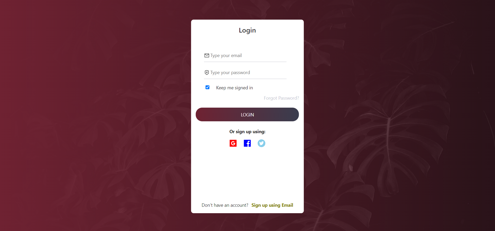
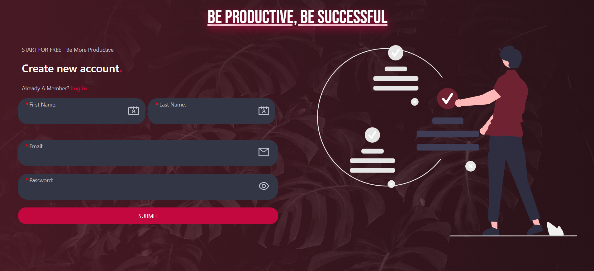
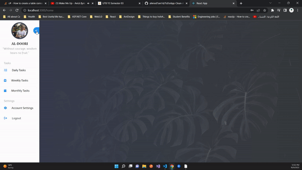

To-Do managment application [Under development].
=======
  
Introduction:
------
Welcome to To-Do managment application where you manage:
  - Daily Tasks
  - Weekly Tasks
  - Monthly Tasks
  - Habit tracking
  - Pormodo Timer  
  And more is coming !

App Inforamtion:
------
`App Name:` To Do. 
`Created By:` Ahmed Al-Doori. 
`Front-End Techs:` HTML5, CSS3, SCSS, JavaScript, ReactJS, CSS Media Quries for Responsive Design, Ant Design library  
`Back-End Techs:` ASP.NET Core API [.NET6], MS SQL Server, JWT 
`Back-End Architecture:` Clean Architecture, CQRS, MediatoR pattern 

What you will be able to do as User:
--------
The system will allow you to do the following:
 - Having your own database of your tasks 
 - Having your own profile 
 - Loggin daily tasks
 - Logging weekly tasks
 - Tracking your habits 
 - Usage of pormodo technique  
 And More is coming ... !
 
 App Internal Features:
 --------
 - ASP.NET Core Identitfication and authentication using JWT
 - Cookies managment
 - ErrorOr library for error handling (overriding .NET Core implementation and using error endpoint)
 - Clean architecture, MediatoR, CQRS  
 - Responsive Design (Mobile Friendly Desing) 
 - Splash Screens 
 - Client/Server Side Validation 
 
 Software || Hardware Requirements:
 -----------
 - Internet Connection is Required
 - IDE that is able to run .net and ReactJS projects [VSCode, VS, Resharper, Rider]
 - Your own database Connection string 
 - .net sdk and run time (.NET6)
 - .net tools for using terminal and ef
 - npm run time SDK
 - when using .NET CLI or CMD for commands follow (https://docs.microsoft.com/en-us/ef/core/cli/dotnet)
 
 Setup Instructions:
 ------------
 (Prefered IDE: Visual Studio Code) 
 <strong>1-</strong> Download the GitRepo as Zip or Pull it to your local repo 

Internal App ScreenShots:
-----------
 **- Login Page:**
</img>
 **- Register Page:**
</img>
 **- Home Page:**
</img>

