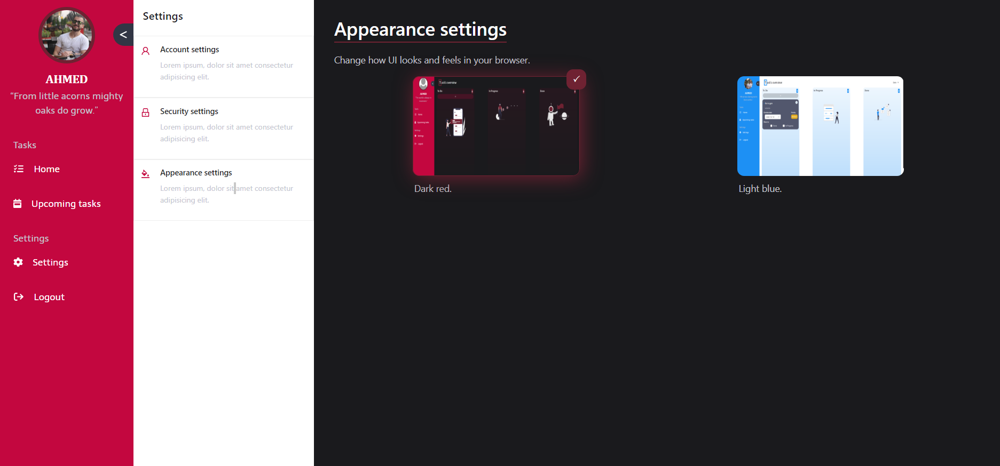

To-Do managment application [Under development].
=======
  
Introduction:
------
Welcome to To-Do managment application where you manage:
  - Current Tasks
  - In Progress Tasks
  - Done Tasks
  - Habit tracking (Soon ..)
  - Pormodo Timer (Soon ..)  
  And more is coming !

App Inforamtion:
------
`App Name:` To Do. 
`Created By:` Ahmed Al-Doori. 
`Front-End Techs:` HTML5, CSS3, SCSS, JavaScript, ReactJS, CSS Media Quries for Responsive Design, Ant Design library  
`Back-End Techs:` ASP.NET Core API [.NET6], MS SQL Server, JWT 
`Back-End Architecture:` Clean Architecture, CQRS, MediatoR pattern 

What you will be able to do as User:
--------
The system will allow you to do the following:
 - Having your own database of your tasks 
 - Having your own profile (Profile picture, 
 - Loggin todo tasks
 - Logging InProgress tasks
 - Loggin finished tasks
 - Deadline for your tasks 
 - Modifying tasks
 - Delete tasks
 - Tracking your habits (Soon...)
 - You will see motivations qoutes in your navbar :)
 - Usage of pormodo technique (Soon...)  
 And More is coming ... !
 
 App Internal Features:
 --------
 - ASP.NET Core Identitfication and authentication using JWT
 - Cookies managment
 - ErrorOr library for error handling (overriding .NET Core implementation and using error endpoint)
 - Clean architecture, MediatoR, CQRS  
 - Responsive Design (Mobile Friendly Desing) 
 - Splash Screens 
 - Client/Server Side Validation 
 
 Software || Hardware Requirements:
 -----------
 - Internet Connection is Required
 - IDE that is able to run .net and ReactJS projects [VSCode, VS, Resharper, Rider]
 - Your own database Connection string 
 - .net sdk and run time (.NET6)
 - .net tools for using terminal and ef
 - npm run time SDK
 - when using .NET CLI or CMD for commands follow (https://docs.microsoft.com/en-us/ef/core/cli/dotnet)
 
 Steps to run the application:
 ------------
 (Prefered IDE: Visual Studio Code) 
1. Clone the repository from the main branch.
2. Assuming you have Visual studio installed.
3. Open "socialchain.solution.sln"
4. Right click on "socialchain.api" and click "Manage user secrets".
   1. Put your own local ms sql server db connection string.
   2. put random secret for JWT.
   3. Put 60 minutes as expire time of JWT token.
5. In visual studio click on "View" in the top task bar => "Terminal"
   1. Run the following command in the terminal to create migration (code first approach):
    ``dotnet ef migrations add "1stToDoMigration" -p .\ToDo.infrastructure\ -s .\ToDo.api\``
   2. From the terminal navigate to "ToDo.api" ``cd .\ToDo.api\ ``
   3. Run the following command to update your database (make sure you are in the api project as step before): 
    ``dotnet ef database update``
6. Run/start the visual studio application  (To make the api running).
> Note: Make sure to grab the address of the API that is running and put it in ``todo.client/constants/ApiConstants.js``
7. Open Visual studio code and navigate to folder "todo.client" and run the following (to install all npm packages): 
  ``npm i``
10. Finally forward to "todo.client" and run the following:
    ``npm start``
ENJOY THE APP :)

Internal App ScreenShots:
-----------
 **- Login Page:**
</img>
 **- Register Page:**
</img>
 **- Home Page:**  
</img>  
**- Settings Page (Account settings):**  
</img>  
**- Settings Page (Security settings):**  
</img>  
**- Settings Page (Appearance settings):**  
</img>  
**- Upcoming Page:**  
</img>